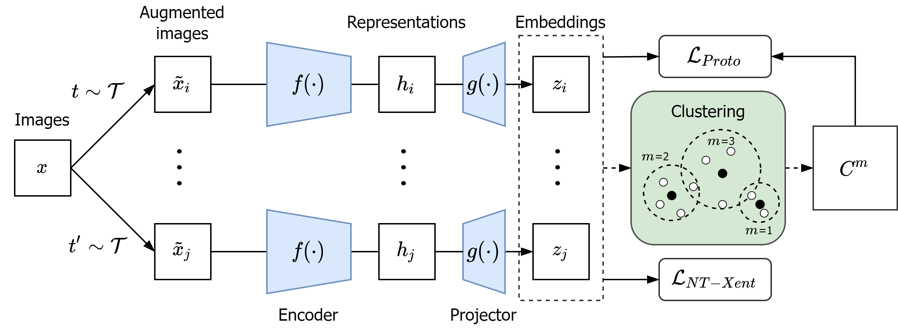

# Density-Based Prototypical Contrastive Learning on Visual Representations
A Self-Supervised Learning method on Representation Learning.

## Create environment
- ```conda env create -n <env_name> environment.yml```
- ```conda activate <env_name>```

```
python pretrain.py
```

